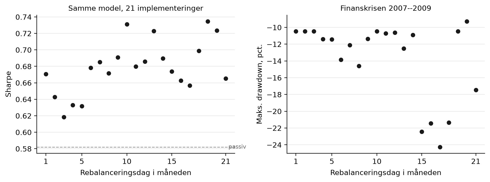

# Timing luck i månedligt rebalancerede regimestrategier

En strategi, der skifter mellem offensiv og defensiv aktieeksponering én gang om
måneden, er i virkeligheden 21 forskellige strategier — én for hver mulige
handelsdag. Sharpe varierer fra **0,618 til 0,735** alene som følge af det valg.
Strategiens fortrin over en passiv position er 0,096. Spredningen på tværs af
arbitrære datovalg er altså større end den effekt, strategien skal påvise.



## Spørgsmålet

Backtests af månedlige strategier rapporteres for én rebalanceringsdato, typisk
månedens sidste handelsdag. Valget er arbitrært. Hvis resultatet afhænger
stærkt af det, er den rapporterede præstation delvis held — og det er en test,
der koster ti linjer kode.

## Data

| | |
|---|---|
| Kurser | SPY og SHY, daglige udbyttejusterede lukkekurser |
| Makro | `T10Y2Y` og `UNRATE` fra FRED |
| Periode | 2. januar 2003 – 17. september 2026 |
| Observationer | 5.965 handelsdage |

Arbejdsløsheden offentliggøres måneden efter referencemåneden, så
observationsdatoen er skubbet en måned frem. Uden den justering overvurderes
strategien systematisk.

## Metode

Regimescore som sum af tre binære signaler: positiv kurvehældning, faldende
arbejdsløshed over 12 måneder, indeks over sit 200-dages gennemsnit. Ved score
≥ 2 holdes offensiv position. Strategien køres 21 gange, én for hver
rebalanceringsdag, og spredningen i udfald rapporteres.

**Forventede fortegn, fastlagt før estimation:** alle 21 varianter har samme
forventede afkast. Forventningen var, at den realiserede spredning alligevel
ville være sammenlignelig med merafkastet over benchmark.

## Resultat

| | Min | Median | Maks | Spredning | Passiv |
|---|---|---|---|---|---|
| Sharpe | 0,618 | 0,678 | 0,735 | 0,032 | 0,582 |
| Årligt afkast | 0,088 | 0,096 | 0,105 | 0,004 | 0,108 |
| Maks. drawdown | −0,411 | −0,411 | −0,411 | 0,000 | −0,803 |

Afkastet er lavere end passiv i alle 21 varianter, så hele Sharpe-gevinsten
kommer fra risikoreduktion. Og den reduktion stammer fra én enkelt episode:

| Episode | Min | Median | Maks | Passiv |
|---|---|---|---|---|
| Finanskrisen (okt. 2007 – mar. 2009) | −0,243 | −0,114 | −0,093 | −0,803 |
| COVID (feb. – apr. 2020) | −0,411 | −0,411 | −0,411 | −0,411 |
| Inflationsåret (jan. – okt. 2022) | −0,293 | −0,261 | −0,261 | −0,281 |

Modellen beskytter kun i finanskrisen, og netop dér svinger det undgåede tab
med en faktor 2,6 mellem den bedste og den værste rebalanceringsdag. I marts
2020 gik ingen af de 21 varianter defensivt: regimescoren faldt fra 3 til 2, da
indekset brød sit 200-dages gennemsnit, men 2 er netop tærsklen, og de to
makrosignaler vendte ikke i tide. Derfor er det samlede drawdown identisk for
alle 21.

De 21 varianter holder samme position på 96,5 procent af dagene og laver 15–19
regimeskift over 23 år. Hele spredningen stammer fra et tocifret antal
beslutninger.

## Kør det

```bash
pip install -r requirements.txt
python src/00_hent_data.py      # makrodata fra FRED
python src/00_hent_priser.py    # kurser via yfinance
python src/analyse.py           # hovedresultater
python src/diagnostik.py        # episodeopdeling og positionsoverlap
python src/figur.py             # hovedfigur
cd paper && latexmk -pdf paper.tex
```

Alle kommandoer køres fra projektets rod.

## Begrænsninger

- Perioden indeholder tre store nedture og 15–19 regimeskift. Spredningen er
  selv estimeret på få begivenheder.
- Regimemodellen er bevidst simpel og replikerer ikke nogen konkret forvalters
  model.
- Offentliggørelsesforsinkelsen for arbejdsløsheden er approksimeret som præcis
  én måned.
- Transaktionsomkostninger indgår ikke. Med højst 19 skift over 23 år ville de
  ikke ændre konklusionen.

## Struktur

```
├── paper/          paper.tex, preamble.tex, figures/
├── src/            00_hent_*.py, analyse.py, diagnostik.py, figur.py
├── data/raw/       downloads fra FRED og yfinance
└── output/         genererede tabeller
```

---
Studieprojekt på offentlige data. Ikke investeringsrådgivning.
